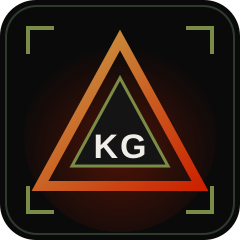

<div align="center">



# Kenneth Gulmatico — Delta Portfolio

**Full-Stack Developer · AI Integration · Security Operations**

I build fast, secure web and mobile products with AI built in, from idea to deployment.

[](https://kennethportfolio-opal.vercel.app)
[](mailto:kenneth.gulmatico@hcdc.edu.ph)
[](https://www.linkedin.com/in/kenneth-gulmatico-53036b375/)


</div>

---

## 👋 About

I'm a **BS Information Technology graduate from Davao City, Philippines**, shipping full-stack web and mobile apps with AI features. I've also worked as a technical support representative and certified as a **Meta Full-Stack Developer**, and trained in **AWS Cloud, CompTIA CySA+, and Cisco SOC**, so security is part of how I build, not an afterthought.

- ✅ **End-to-end delivery:** UI, API, database, and deployment
- 🔐 **Security-first:** SOC and CySA+ trained, with real support-desk experience
- 💬 **Clear communication:** plain-language updates for non-technical clients
- 📚 **Fast learner:** 30+ certifications and counting

---

## 🛠️ Services

| Service | What you get |
|---|---|
| **Web & Mobile Development** | Next.js / React apps, Supabase & Postgres backends, Expo / Kotlin / Flutter mobile, dashboards & admin panels |
| **AI Integration & Automation** | LLM & RAG features, chatbots & moderation, on-device ML (TFLite), AWS generative AI |
| **Security & IT Support** | Security reviews, log & threat triage, hardened app setup, tech support & docs |
| **UI & Graphic Design** | UI/UX mockups, brand & social assets, thesis & report layout |

---

## 🏅 Certifications

| Certification | Issuer | Verify |
|---|---|---|
| **Meta Full-Stack Developer: Front-End & Back-End** (10-course specialization) | Meta · Coursera | [Verify](https://coursera.org/verify/specialization/9R4EKO0WURFW) |
| **CompTIA CySA+ (CS0-003): Security Operations** | Pearson · Coursera | [Verify](https://coursera.org/verify/35GOE6AVC4YQ) |
| **CompTIA CySA+ (CS0-003): Certification Exam Prep** | Pearson · Coursera | [Verify](https://coursera.org/verify/QLB02EH53O5T) |
| **Security Operations Center (SOC)** | Cisco · Coursera | [Verify](https://coursera.org/verify/E2C65XN5VGWL) |

Plus 12 AWS certificates (Cloud Practitioner, Generative AI, Machine Learning, Security & Governance, and more) and others in RAG, full-stack development, data science, and agile project management. See them all on the [live site](https://kennethportfolio-opal.vercel.app/#certifications).

---

## 🚀 Featured Work

| Project | What it does | Stack | Links |
|---|---|---|---|
| **SBG Portal** · *Live client project* | Gym & membership system with public site, QR check-in, belt progression, and role-based member portal | Next.js 16, React 19, Supabase, Tailwind v4 | [Live](https://sbg-portal.netlify.app/) · [Code](https://github.com/Daddyk5/SBG-Portal) |
| **LegalEase** · *AI Contract Analyzer* | Scans contracts by camera or PDF and gives a plain-language verdict based on the Philippine Civil Code, with offline on-device ML | Kotlin, Jetpack Compose, Gemini AI, ML Kit, TFLite | [Code](https://github.com/Daddyk5/LegalEase) |
| **AniChain** · *Market Price Tracker* | Live food-price board for Davao City markets with charts, watchlists, alerts, and AI trend summaries | Expo, TypeScript, Hono, PostgreSQL, Claude AI | [Code](https://github.com/Daddyk5/AniChain-a-digital-food-stock-tracker-for-agriculture) |
| **Yamashita Hono Fitness** | AI fitness coach that only recommends real exercises from an 876-exercise database | React, Vite, Express, PostgreSQL, Capacitor | [Code](https://github.com/Daddyk5/Yamashita-Hono-Fitness-App) |
| **Decision Dashboard** | Operations dashboard for inventory, orders, deliveries, and payments, feeding live data to Power BI | Django, PostgreSQL, Supabase, Power BI | [Live](https://decision-dashboard-7e3f.onrender.com) · [Code](https://github.com/Daddyk5/Decision-Dashboard-) |
| **Little Lemon API** · *Meta capstone* | Restaurant REST API with menu, cart, and orders, role-based access, and token auth | Django REST Framework, Djoser | [Code](https://github.com/Daddyk5/Little-Lemon-API) |
| **BRO Protocol** · *AI reply assistant* | Mobile app and Chrome extension that drafts chat replies in a chosen tone, with on-device screenshot OCR | Flutter, TypeScript, Claude AI | [Code](https://github.com/Daddyk5/BRO-Protocol-) |

More projects, including ProspectIQ, CipherChain, Ping AI Pilot, and MoodSensor, are on my [GitHub](https://github.com/Daddyk5?tab=repositories).

---

## ✨ Site Features

- 🎬 **Cinematic system-boot intro** and tactical HUD theme
- 🎧 **Ambient audio HUD** with user controls (Howler.js)
- 🌀 **Smooth scrolling & scroll-triggered animations** (Lenis, GSAP, Framer Motion)
- 📱 **Fully responsive**, from mobile to ultrawide
- ⚡ **SEO & Open Graph metadata** for clean link previews
- 📄 **One-click resume download**

**Sections:** Hero · About · Services · Impact · Experience · Projects · Skills · Certifications · Learnings · Contact

---

## 🧰 Tech Stack

- **Framework:** Next.js 16 (App Router), React 19, TypeScript
- **Styling:** Tailwind CSS v4
- **Motion:** Framer Motion, GSAP, Lenis, tsParticles, react-type-animation
- **Audio:** Howler.js
- **Icons:** Lucide
- **Hosting:** Vercel

---

## ⚙️ Run Locally

```bash
git clone https://github.com/Daddyk5/Delta-Portfolio.git
cd Delta-Portfolio
npm install
npm run dev
```

Then open [http://localhost:3000](http://localhost:3000).

| Script | Purpose |
|---|---|
| `npm run dev` | Start the dev server |
| `npm run build` | Create a production build |
| `npm run start` | Serve the production build |
| `npm run lint` | Run ESLint |

### Project structure

```
src/
├── app/          # Layout, global styles, page entry
├── components/   # Hero, About, Services, Projects, Skills, Contact, ...
└── hooks/        # Audio provider
public/
├── images/       # Hero and profile images
├── audio/        # Ambient sound
└── Certifications/
```

---

## 📬 Let's Work Together

Need a website, a mobile app, or AI in your workflow? I'm open to freelance and full-time roles.

<div align="center">

[](mailto:kenneth.gulmatico@hcdc.edu.ph)
[](https://github.com/Daddyk5)
[](https://www.linkedin.com/in/kenneth-gulmatico-53036b375/)
[](https://t.me/Firekai1)
[](https://www.facebook.com/Kdashu88)
[](tel:+639054549950)

**📍 Davao City, Philippines** · Available for remote work

<sub>© 2026 Kenneth Gulmatico. All rights reserved.</sub>

</div>
